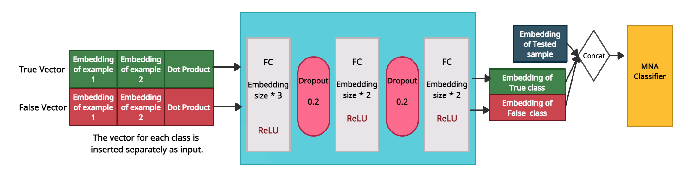

# Meta Learning Based Deception Detection From Speech
**Noa Mansbach and Amos Azaria**

## Abstract:
It is difficult to overestimate the importance of detecting human deception, specifically by using speech cues. Indeed, several works attempt to detect deception from speech. Unfortunately, most works use the same people and environments in training and in testing. That is, they do not separate training samples from test samples according to the people who said each statement or by the environments in which each sample was recorded. This may result in less reliable detection results.   
In this paper, we take a meta-learning approach in which a model is trained on a variety of learning tasks to enable it to solve new learning tasks using only a few samples. In our approach, we split the data according to the persons (and recording environment), i.e., some people are used for training, and others are used for testing only, but we do assume a few labeled samples for each person in the data set.   
We introduce CHAML, a novel deep learning architecture that receives as input the sample in question along with two more truthful samples and non-truthful samples from the same person. We show that our method outperforms other state-of-the-art methods of deception detection based on speech and other approaches for meta-learning on our data-set.  
Namely, CHAML reaches an accuracy of 61.34% and an F1-Score of 0.3857, compared to an accuracy of only 55.82% and an F1-score of only 0.3444, achieved by a previous, most recent approach.

## CHAML Model:

## Paper:
**Mansbach, N.; Azaria, A.
Meta Learning Based Deception Detection from Speech.
Appl. Sci. 2023, 13, 626. https://doi.org/10.3390/app13010626 .**
